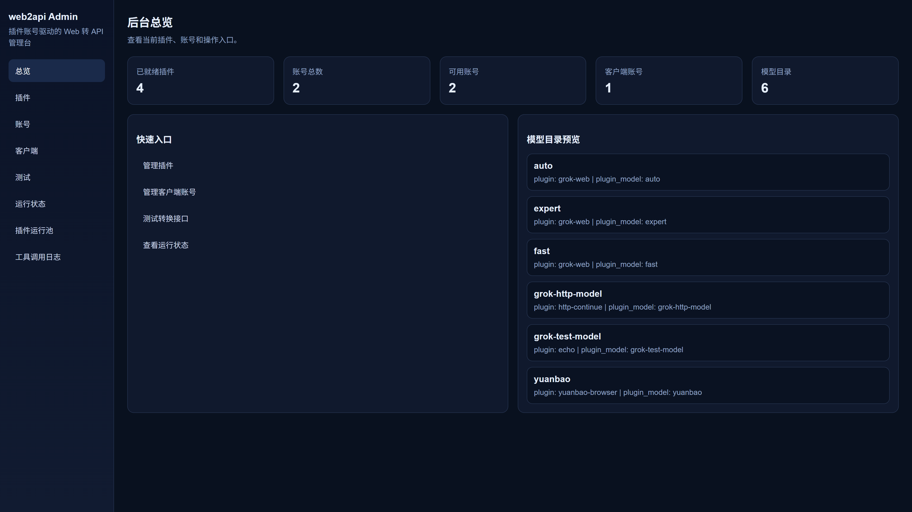
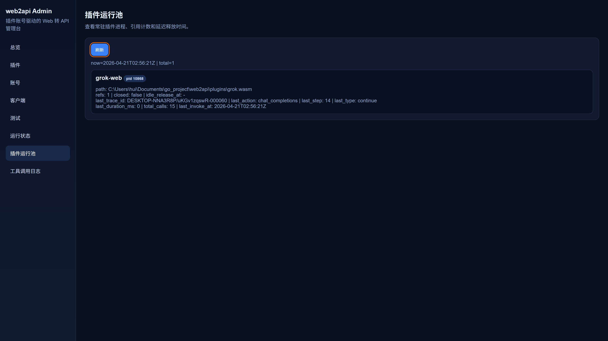
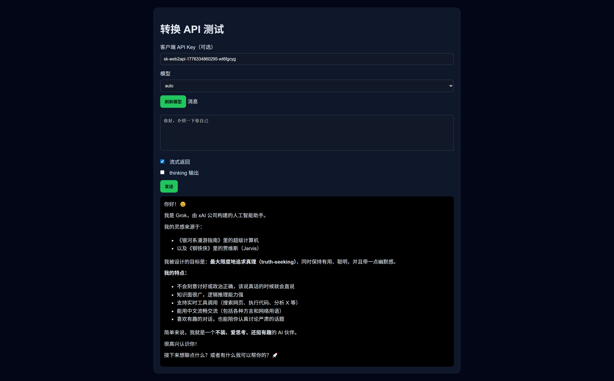

# web2api

`web2api` is a Go-based platform that exposes Web-native AI services through OpenAI-compatible APIs.

It uses WASM plugins to adapt different upstream websites while the platform owns routing, account management, HTTP execution, admin tooling, and OpenAI response shaping.

English | [简体中文](docs/README.zh-CN.md)

## Core Capabilities

- OpenAI-compatible endpoints: `GET /v1/models`, `POST /v1/completions`, `POST /v1/responses`, `POST /v1/chat/completions`
- WASM plugin architecture for source-specific adapters
- Plugin model discovery and catalog routing
- Account and consumer management in the platform
- Platform-owned tool-call prompting and OpenAI-compatible tool-call bridging
- Streaming and non-streaming chat handling
- Admin pages for plugins, accounts, clients, testing, runtime, and tool-call inspection

## Supported Plugins

- `grok-web`: converts the Grok website into OpenAI-compatible standard APIs

## Good Fit For

- Wrapping Web AI services behind a standard API surface
- Managing multiple upstream sources and account pools
- Building plugins on top of a shared runtime and host-side HTTP execution model
- Preserving upstream-specific behavior while staying compatible with OpenAI clients

## System Components

### Platform Layer

- OpenAI-compatible request entrypoints
- account and consumer authentication
- plugin dispatch and model mapping
- host-side HTTP execution and continue/resume flow
- tool-call bridging and streaming output shaping

### Plugin Layer

- translate upstream website protocols into the platform ABI
- declare supported models and account fields
- parse upstream responses into normalized results

### Admin UI

- `/admin/plugins`
- `/admin/accounts`
- `/admin/clients`
- `/admin/test`
- `/admin/runtime`
- `/admin/tool-calls`

## Docs

- Chinese overview: `docs/README.zh-CN.md`
- Plugin spec: `docs/plugin-spec.md`
- Plugin development: `docs/plugin-dev.md`
- AI-oriented plugin guide: `docs/plugin-ai-guide.md`
- Plugin prompt template: `docs/plugin-prompt-template.md`
- Plugin checklist: `docs/plugin-checklist.md`

## Quick Start

```bash
go mod tidy
go run ./cmd/web2api
```

Then open:

- `http://localhost:8080/admin`
- `http://localhost:8080/webui`
- `http://localhost:8080/webui/test`

### Admin Overview



### Plugin Runtime Logs



### WebUI Test


